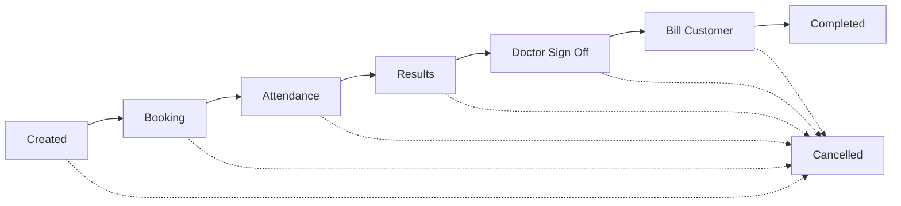

# Billing Overview — Product Source of Truth

*A plain-English explanation of how billing works in `carelever_assessment`.*

*Last updated: 2026-05-29*

---

## TL;DR

- Every company is **invoice** (pay later via an invoice we send) or **prepaid** (we charge their saved card). Classification is locked at company setup and snapshotted onto each referral at creation; it never changes mid-referral.
- A referral's life: **Created → Booking → Attendance → Results → Doctor Sign Off → Bill Customer → Completed**. Cancellation can happen any time and overlays the in-progress stage.
- Pricing is locked at **three points**: (1) when the referral is created, the site/company/service price cascade resolves and stamps a base price; (2) at appointment attendance, a supplier-specific overlay applies (affiliate price + remote fee if external clinic); (3) at billing, that price is copied forward unchanged — **except combos**, which collapse matching services into one combo-priced line at billing time.
- Billing fires **once per referral, after doctor sign-off**. We don't bill per appointment. Until billing succeeds, the referral is in "Bill Customer" and results are **not released** to the candidate/client.
- Failed Stripe charges and failed invoice submissions surface on a **billing failures dashboard** (Settings → Billing, **internal staff only**). No automatic retry — internal staff manually retries from the dashboard. For prepaid failures, if the card needs replacing, the customer does that themselves via their own Settings → Billing flow (separate surface, no failure visibility); internal staff then triggers the retry. For invoice failures, internal staff fix the data and re-submit.

---

## The two flows

Every company is classified once as either **invoice** or **prepaid**. Referrals inherit the classification at creation; subsequent company-level changes only affect *new* referrals.

| | **Invoice** | **Prepaid** |
|---|---|---|
| Who pays? | Company gets an invoice from us | Company's saved card is charged |
| When? | At billing (after sign-off) we submit line items to the invoicing system; that system handles the invoice cadence | At billing, we charge the saved card off-session (no card prompt — they consented when they saved it) |
| Card on file? | No | Yes — saved once via a "save card" flow; one card per company |
| Purchase orders? | Yes — invoice carries the PO number | No |
| Failure mode | Invoicing system rejects the line items | Card declines, expired, insufficient funds, etc. |

Both flows go through the same internal pipeline; only the final payment action differs.

---

## Referral lifecycle (the 7 states)

The status the user sees on the referral detail page. **Derived from the data** — not a stored state — so it reflects the current reality of the referral's services and appointments.

| # | State | What it means | What's happening |
|---|---|---|---|
| 1 | **Created** | Referral exists | Services chosen, awaiting booking |
| 2 | **Booking** | Appointments being booked | One or more services have appointment intent / are confirmed |
| 3 | **Attendance** | Candidate attending | Some/all appointments reached, attendance recorded (or no-show) |
| 4 | **Results** | Clinical results are back | The lab/clinic returned results; outcome not yet finalised |
| 5 | **Doctor Sign Off** | A doctor is reviewing | Required for services that need a medical sign-off; auto-skipped for services that don't |
| 6 | **Bill Customer** *(NEW)* | Billing in progress | All required sign-offs done — we're converting unbilled items into billed line items and submitting to invoice / Stripe |
| 7 | **Completed** | Done — results released | Billing succeeded, results delivered to candidate/client |
| — | **Cancelled** | Referral cancelled | Overlays whatever stage the referral was in |

**Key invariant**: results are **only released after billing succeeds**. If billing fails, the referral sits in Bill Customer; results stay held.

---

## Pricing — the three lock points

The price a customer pays is locked progressively as the referral moves forward. **No retroactive changes** once locked; corrections go through delete+create.

| Lock point | When | What's resolved | Stored where |
|---|---|---|---|
| **1. Referral created** | Service added to referral | Site → Company → Service price cascade (most-specific wins) | Locked onto the service |
| **2. Appointment attended** | Candidate attends | Supplier overlay applied: if the clinic is an external (non-KINNECT) clinic, use the affiliate price; if a remote fee applies, add it on top. This is the **final price** | "Unbilled" row for the service |
| **3. Bill the customer** | At billing (after sign-off) | **Pure copy-forward** — the price set at attendance is what bills. **Exception: combos** (see below). | "Billed" line item |

**Important nuance — the price is frozen at attendance.** If a clinic's pricing changes between attendance and billing (days later), the price captured at attendance is still what bills. This avoids silent price drift.

**For action fees** (no-show, late cancel, reschedule), the percentage is applied to the **referral-creation locked price**, not the supplier-overlaid price — those fees fire *before* attendance, so the supplier overlay never applied.

---

## Combos

A **combo** is a special bundle: *"if these specific services are all on a single referral, bill them as ONE combo line item at a special price, instead of summing them individually."* Configured by ops per company/site.

Examples:
- "Pre-Employment Standard": drug test + hearing test + spirometry → $X (single line)
- "Mining Pre-Employment": all of the above + chest X-ray + vision → $Y (single line)

**When combos apply**: at the **billing step** (after sign-off, when we convert unbilled → billed). The system looks at the services on the referral and greedily matches the largest combo first, then recurses on leftovers to match more combos. Unmatched services bill individually at their attendance prices.

**Combo behaviour:**
- **Replaces, doesn't discount**. A combo collapses the matched services into ONE line at the combo price. The individual service prices are discarded.
- **Combos cascade**: defined at global / company / site level — most-specific wins. Site combos override company combos override global combos.
- **Supplier-aware**: combos have both a kinnect price and an affiliate price; if any service in the combo was at an external clinic, the affiliate combo price applies (+ remote fee).
- **Affiliate clinic-booking fee stays separate** — not absorbed into a combo (see Fees below).
- Combos **replace the old "Pricing Rules / Discounts" feature** (removed 2026-05-28). There are no discounts in the system; combos handle the equivalent "specific services → adjusted price" need.

---

## Purchase Orders & Cost Centres (invoice flow only)

**Purchase Order (PO)** = a code the customer's finance team issues to authorise a spend; stamped on the invoice so the customer's accounting can map the charge.

**Cost Centre** = the customer's internal accounting bucket the spend should be attributed to.

Both are **invoice-flow only**. Prepaid companies don't use POs.

### Two PO modes

| Mode | How it works |
|---|---|
| **Individual** | Each referral has its own PO number entered manually |
| **Blanket** | The company has one or more "blanket PO" documents uploaded as supporting documentation covering multiple referrals. The PO number, max-value, and expiry date are **recorded for reference only** — the system does **not** drain the cap, enforce the expiry, or block bills against an exhausted/expired PO (product decision 2026-05-29 — upload/store only) |

### Three sources for the PO / cost-centre values on a referral

When a referral is created, the system tries each in order, filling whatever's still blank:

1. **PO assignment rules** (highest priority). Ops configure rules like *"for Sydney site + new employees, use PO ABC-001 + cost centre DEF-002"*. The first matching rule's values are stamped on the referral.
2. **Billing Defaults** (fallback). Company / site-level defaults — fill whichever fields the rule didn't.
3. **Config's default cost centre** (last resort, cost centre only). If still no cost centre, drop in the config default.

If a PO value would have been blacklisted (see below), it's skipped.

### PO Blacklist

A global list of disallowed PO values (e.g. retired or invalid PO codes). Checked at:
- Rule definition (can't save a rule with a blacklisted PO)
- Manual PO entry (referral creation / billing defaults)
- The assignment resolver (won't auto-stamp a blacklisted value)

Add and delete only — no edit. Case-and-punctuation-insensitive matching ("PO-123" and "po 123" collide).

---

## Fees

Three kinds of fee lines can land on an invoice/charge:

### 1. Service charges

The main thing being billed — the services the candidate actually received. One billed line per attended service (combined into a combo line if a combo matches). Priced per the lock points above.

### 2. Action fees (no-show, late cancel, reschedule)

When a candidate doesn't show up, cancels close to the appointment, or reschedules late, an **action fee** applies. Rules:

- **Configured per company** (with a global fallback). A matrix by clinic type (internal/external/split) × lead-time window (within 1 day / 1-3 days / 3+ days).
- Each matrix cell is either a percentage of the service price or a fixed amount.
- **No-show** also reads from the matrix (defaults to 100% but admins can edit) — fixes a prototype bug where no-show was hardcoded 100% and ignored config edits.
- **Independently billed via a cron job** — not tied to the referral's sign-off. The cron runs daily and bills any non-attended fee older than ~12 hours (gives time to revert a mistaken cancel without charging).
- **Revert-to-confirm** flow exists: if internal staff put an appointment into no_show/cancelled/rescheduled by mistake, they can revert it back to confirmed before the cron bills — the pending fee is destroyed.
- **Fee preview** shown in the UI before confirming a cancel/reschedule — the user sees "this will incur a $X fee" before they commit.

### 3. Affiliate clinic-booking fee

When **any** service on the referral was delivered at a non-KINNECT (affiliate) clinic, one extra fee line is added — **once per referral**, regardless of how many appointments. Configured per company (with a global fallback). Two variants: a `standalone_fee` (single service booking) and a `collection_fee` (bundle/collection).

Created when the first qualifying appointment is attended; promoted to a billed line item at the payment step, separately from combo collapsing (never absorbed into a combo).

---

## Sign-off and the payment step

Billing **doesn't fire per appointment**. It fires **once per referral**, when:

- All services requiring doctor sign-off have been signed off, **and**
- All services that don't require sign-off are otherwise complete

At that moment the referral enters the **"Bill Customer"** state, and the system:
1. Converts all unbilled service-charge rows into billed line items (combos collapse here)
2. Appends the affiliate-fee line if applicable
3. Submits to the invoicing system (invoice flow) or charges the saved card (prepaid flow)
4. On success → stamps "billing completed" → results released → referral marked Completed
5. On failure → none of the above stamps happen → referral stays in Bill Customer → results held → entry appears on the failures dashboard

**Action fees are separate**: they bill on the cron schedule, regardless of sign-off. Different track.

---

## Failure handling

Stripe charges and invoice submissions can fail (declined card, expired card, system down, etc.). When that happens:

- The referral **stays in Bill Customer**; results **stay held**.
- A **failure record** is written (with the reason, timestamp, who attempted).
- **Internal staff only** — a badge appears on the **internal** referral detail page and the entry shows on the **failures dashboard** at Settings → Billing in the **internal portal**. Customers see results held (because billing isn't complete) but **no failure-specific UI** — no badge on their referral, no failures list, no error reason exposed.
- **No automatic retry** — operations decides manually.

### Manual retry paths

| Failure type | Retry options |
|---|---|
| Stripe charge declined | Internal staff triggers **Retry** on the failures dashboard — the retry uses the company's currently-saved card. If a new card is needed, the customer replaces it via their own Settings → Billing flow first (separate surface, no failure visibility); internal staff then triggers the Retry, which picks up the new card automatically |
| Invoice submission rejected | Internal staff investigates the rejection reason, fixes the underlying data, and manually re-submits via the internal-portal button |

Once a retry succeeds, the failure is "resolved" and the referral advances to Completed → results release.

---

## Operational signals (issues)

Beyond billing failures, billing-adjacent signals automatically flag operational issues on the referral:

- **Confirmed-appointment overdue**: an hourly cron looks for appointments stuck in "confirmed" more than 3 hours past their scheduled start time. If found, an "issue" is logged on the referral. Auto-resolves when the appointment is transitioned out of confirmed (e.g. an operator marks it attended or no-show).
- More signals can be added later (this is the first one).

---

## What product configures (admin UIs)

These are the surfaces where ops/admins set things up. All under **Settings → Billing** (or per-company billing tabs):

| Setting | Where | What it controls |
|---|---|---|
| Affiliate fee (global default) | Settings → Billing → Affiliate Fee | The fallback affiliate clinic-booking fee, used when a company doesn't override |
| Non-attended fees (global defaults) | Settings → Billing → Non-Attended Fees | The matrix fallback used when a company doesn't override |
| NetSuite locations | Settings → Billing → NetSuite Locations | Lookup of valid invoice locations; tied to clinics/services |
| PO blacklist | Settings → Billing → PO Blacklist | Disallowed PO codes |
| Combos | Settings → Combos (or similar) | Combo definitions (services → combo price), cascaded by site/company/global |
| Company affiliate fee | Per-company → Billing | Company-level override of the global affiliate fee |
| Company non-attended fees | Per-company → Billing | Company-level override of the global matrix |
| **Invoicing tab** (per company) | Per-company → Invoicing | One-stop shop for: requirements toggles (PO required? cost centre required?), PO type (individual/blanket), billing defaults (the cascade), service defaults, **PO assignment rules**, PO documents (blanket POs), manual override toggle, change history |
| Change history (audit log) | Per-company → Invoicing → Change History | Read-only log of recent edits to all of the above |
| Service prices | Service item / Site / Company price tabs | The price cascade — most-specific wins |

---

## What the candidate / client sees

- **Quoted price** during booking: the locked base price from referral creation, plus a small disclaimer note ("Supplier and remote fees may apply — final price is set at appointment attendance"). The system doesn't show a dynamic "current estimated total" — final price is locked when the appointment is attended.
- **Cancel/reschedule preview**: before confirming, the candidate sees the action fee that will apply ("This will incur a $X fee").
- **Results**: only after billing succeeds. If billing fails, results are held until a manual retry succeeds.
- **Receipt / invoice**: handled downstream by the invoicing system (invoice flow) or via Stripe (prepaid).
- **Billing failures**: customers see results held (per above) but **no failure-specific UI** — no banner, no error reason, no failures list. They continue to manage their saved card normally via Settings → Billing. Internal staff resolves failures and triggers retries; if a card needs replacing, internal staff communicates with the customer out-of-band.

---

## Glossary

| Term | Meaning |
|---|---|
| **Referral** | A request for a candidate to undergo one or more services |
| **Service** | One item the candidate goes through (e.g. drug test, hearing test) |
| **Service item** | The catalog entry for a service (master list, not the per-referral instance) |
| **Bundle** | A service catalog item composed of multiple component services (priced as a unit). Distinct from a combo |
| **Combo** | A billing-time rule: "these specific services together bill as ONE line at this price" |
| **Appointment** | A scheduled clinic visit; covers one or more services on a referral |
| **Supplier** | The clinic/provider delivering services. KINNECT (internal) vs affiliate (external) |
| **Site** | The customer's location (e.g. a mine, an office) |
| **Position** | The role the candidate is being hired for (drives which services apply) |
| **Unbilled line item** | An internal staging record — the work happened, billing hasn't yet |
| **Line item** | The billed record — what's on the invoice / Stripe charge |
| **Invoice flow / CLB** | Companies that pay via invoice; line items go to our invoicing system (called CLB internally) |
| **Prepaid flow / Stripe** | Companies with a saved card; line items get charged via Stripe |
| **Sign-off** | A doctor finalising the medical outcome of a service that needed clinical review |
| **Bill Customer state** | The referral's status while billing is happening — between sign-off and Completed |
| **Action fee** | A penalty fee for no-show, late cancel, or late reschedule |
| **Affiliate fee** | The clinic-booking fee that applies once per referral when an external clinic was used |
| **PO** | Purchase Order — a customer-issued code authorising a spend, stamped on the invoice |
| **Blanket PO** | A pre-authorised PO document covering multiple referrals, uploaded as supporting documentation. The system records the PO number, max-value, and expiry but does not enforce them (upload/store only) |
| **Cost centre** | The customer's internal accounting bucket the spend is mapped to |
| **PO blacklist** | Global list of disallowed PO values |
| **Failure dashboard** | The Settings → Billing surface where failed Stripe charges / invoice submissions appear for manual retry |

---

## Quick reference: who pays what, when?

| Scenario | Bills | When | How |
|---|---|---|---|
| Standard referral, all attended, signed off | Service charges (+ combos applied) + affiliate fee if external clinic involved | Right after the last sign-off | Invoice or Stripe based on company classification |
| Candidate no-shows | Just the action fee (no service charge — no service delivered) | ~12 hours after the no-show (via cron) | Invoice or Stripe |
| Late cancel (within fee window) | Just the late-cancel action fee | ~12 hours after the cancel | Invoice or Stripe |
| Late reschedule (within fee window) | Just the reschedule action fee | ~12 hours after the reschedule | Invoice or Stripe |
| Walk-in appointment, no booking | No action fees apply (no booking to break); service charges as usual | At sign-off | Invoice or Stripe |
| Internal-booking only (no candidate-facing booking) | No action fees apply; service charges as usual | At sign-off | Invoice or Stripe |
| Clinic unavailable (clinic side problem) | No fees apply | — | — |
| Billing fails | Nothing yet — referral sits in Bill Customer, results held | When ops manually retries | Invoice or Stripe |

---
