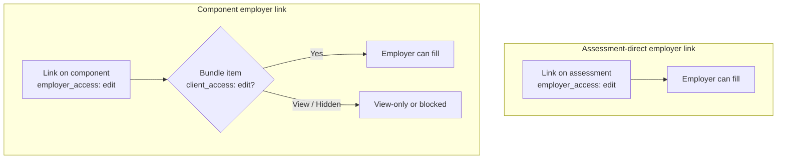
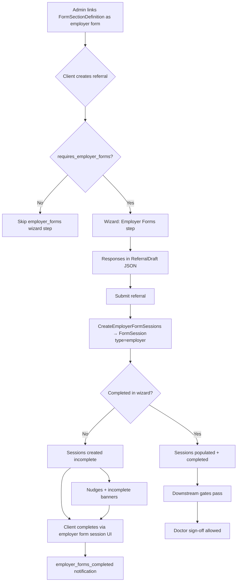

# Employer Questionnaire

How employer (client-portal) questionnaires are configured, gated, and filled in.

Source of truth (ported from): `carelever-replit-reimagined`  
Port target: `carelever_assessment` + `carelever_assessment_ui`

Related: [Form data model](./form-data-model.md), [Referral / service workflow](../assessment/referral-service-workflow.md), [Results tab overview](../results-tab-overview.md)

---

## What it is

An **employer questionnaire** is a modular form (`FormSectionDefinition`) that the **employer / client user** (HR) fills in about a referral — job details, exposure history, site-specific info, etc.

It is separate from:

| session_type | Who fills it | Purpose |
|---|---|---|
| `candidate` | Candidate | Pre-assessment / health questionnaire |
| **`employer`** | **Employer / client** | **Employer-provided information** |
| `assessor` | Clinic staff | Records test results at appointment |
| `doctor` | Reviewing doctor | Medical review sign-off |

Runtime instances are `FormSession` rows with `session_type: 'employer'`, one per service + form section definition.

---

## Configuration — two link locations

Both use `ComponentFormSectionLink` with `for_employer: true`. The difference is **which `service_item` owns the link**.

| Where in Internal Settings | Link `service_item_id` | Typical use |
|---|---|---|
| **Component** edit → Forms → Employer Questionnaires | The **component** (e.g. Medical Examination) | Questionnaire tied to that clinical piece; follows the component wherever it is bundled |
| **Assessment** edit → Forms → Employer Questionnaires | The **assessment / bundle** itself (e.g. Arsenic Medical) | Questionnaire specific to this assessment product; not tied to one component |

At referral time the wizard **merges both** (`ReferralDraft#employer_form_links`):

```
direct_employer_form_links   — link on the assessment
+ component_employer_form_links — link on a child component in the bundle
```

If the same `form_section_definition_id` appears in both places, the first match wins (deduped by section id).

### Per-link role access (`ComponentFormSectionLink`)

On **employer questionnaire rows** (component or assessment), each link has per-role access:

- Employer / Candidate / Assessor / Doctor
- Levels: `hidden`, `view`, `edit`

Only links with **`for_employer: true` + `employer_access_level: 'edit'`** enter the employer-forms workflow.

New employer links default to: employer=edit, assessor=view, doctor=view, candidate=hidden (`ComponentFormSectionLinks::Create`).

### Assessment-only: bundle component access (`ServiceBundleItem`)

On the **assessment** Forms accordion, each **component card** (Medical Examination, Medical History, …) exposes Candidate / **Client** / Assessor dropdowns. These are **not** per-form — they apply to everything that component contributes to this assessment for the active variation tab.

| Column | Model field | Scope |
|---|---|---|
| Client | `client_access_level` | `ServiceBundleItem` |
| Candidate | `candidate_access_level` | `ServiceBundleItem` |
| Assessor | `assessor_access_level` | `ServiceBundleItem` |

- Set in **Internal Settings → Assessment → Forms** (component cards), **not** per referral.
- Can differ per **service variation** (Baseline vs Periodic tabs).
- Default: `view`.
- **Not** set on the Components accordion (membership only) or on read-only inherited form preview rows.

Regular (non-employer) forms on a **component** settings page have **no** per-link access dropdowns — bundle-level access on the assessment is the control (legacy / Replit parity).

Assessment-level employer links are **not scoped by variation tab** — they apply across all variations.

---

## Access gates at runtime



| Source | Link needs `employer_access_level: edit` | Bundle `client_access_level: edit` required? |
|---|---|---|
| Assessment → Employer Questionnaires | Yes | **No** — direct link skips bundle gate |
| Component → Employer Questionnaires | Yes | **Yes** — component card Client must be **Editable** |

`ReferralDraft#requires_employer_forms?` and `Referrals::CreateEmployerFormSessions` both use this logic.

Direct link check (`accessible_link?`):

```
is_direct_link = link.service_item_id == service.service_item_id
is_direct_link || bundle_item.client_access_level == 'edit'
```

---

## End-to-end flow



### Client referral wizard

- Step `employer_forms` appears when `ReferralDraft#requires_employer_forms?` is true.
- Skipped for **internal wizard** (KINNECT staff creating on behalf of employer).
- Draft stores answers in `employer_form_responses` (keyed `modular_<form_section_definition_id>`).
- On submit, `Referrals::CreateEmployerFormSessions` creates sessions and optionally copies wizard answers.

### Post-creation completion

Client portal completes incomplete sessions (auto-save, file upload, submitter signature on complete).

Optional prefill: **Form Response Templates** (company / site / position scoped) via `FormResponseTemplateResolver`.

### Downstream gates

| Portal | Behaviour |
|---|---|
| Client | Banner for referrals with incomplete employer forms |
| Candidate | Timeline waits for employer sessions before treating pre-assessment step as done (when candidate-editable forms exist on bundle) |
| Doctor | Sign-off blocked until `referral.employer_forms_complete?` |
| Notifications | `employer_forms_incomplete` on create; `employer_forms_completed` when all done |
| Nudges | `employer_form_reminder` (48h) if incomplete after create |

---

## Data model summary

| Concept | Model / field |
|---|---|
| Form blueprint | `FormSectionDefinition` |
| Link to service / component | `ComponentFormSectionLink` (`for_employer`, `employer_access_level`, …) |
| Bundle membership + portal access | `ServiceBundleItem` (`client_access_level`, `candidate_access_level`, `assessor_access_level`) |
| Per-referral instance | `FormSession` (`session_type: 'employer'`, `belongs_to :service`) |
| Answers | `FormFieldResponse` |
| Wizard draft answers | `ReferralDraft#employer_form_responses` (JSONB) |
| Saved prefill patterns | `FormResponseTemplate` |
| Completion | `FormSession#completed_at`, `submission_signature_data` |

Referral helpers:

```ruby
referral.employer_form_sessions      # all employer sessions on referral services
referral.employer_forms_complete?    # all sessions completed (or none exist)
referral.employer_forms_incomplete   # incomplete sessions
```

---

## Internal Settings UI map

```
Component settings (service-item-components)
└── Employer Questionnaires     → link + per-link role access (on component)

Assessment settings (service-item-assessments)
├── Component cards             → bundle Client / Candidate / Assessor access
│   └── read-only inherited form previews (no access dropdowns)
└── Employer Questionnaires     → link + per-link role access (on assessment)
```

**When to link on the component:** questionnaire belongs to that clinical piece; reuse across assessments.

**When to link on the assessment:** questionnaire is product-specific; applies across all variants without per-component setup.

---

## Port status (carelever_assessment / UI)

| Area | Status |
|---|---|
| `ReferralDraft#employer_form_links`, `requires_employer_forms?` | Ported |
| `Referrals::CreateEmployerFormSessions` | Ported |
| Internal Settings — assessment Forms accordion (bundle access + employer Q) | Ported |
| Internal Settings — component Forms (employer Q) | Ported |
| Client referral wizard `employerForms` step | Ported (UI) |
| Client employer form session completion UI | Check port tracker / open tickets |
| Form response templates (prefill) | Partial — verify client settings |

Replit reference implementations:

- `app/controllers/client/employer_form_sessions_controller.rb`
- `app/controllers/concerns/wizards/client/step_data.rb` (`employer_forms` step)
- `app/services/referrals/wizard_create_service.rb` (`create_employer_form_sessions`)
- `app/views/admin/service_items/_tab_form_assessment.html.erb`

Assessment port:

- `app/models/referral_draft.rb`
- `app/services/referrals/create_employer_form_sessions.rb`
- `apps/internal/.../forms-accordion.component.*`
