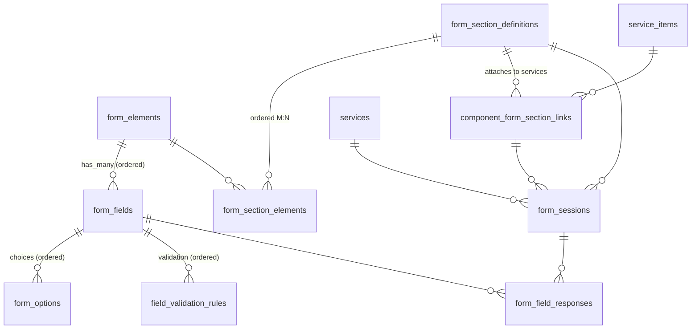

# Form Data Model

How forms are authored (modular component system), attached to services, and filled in.

- **Authoring:** `form_elements` / `form_section_definitions → form_fields`.
- **Attachment:** `component_form_section_links` attach a definition to a service.
- **Runtime:** `form_sessions → form_field_responses`.

---

## ERD



---

## Authoring — Components (modular)

Reusable building blocks composed into sections, designed for reuse across services.

```
form_element (reusable block; name unique, configuration jsonb, system_managed, archived)
  └── form_field (field_key, field_type, required, configuration jsonb,
                  visible_when_* conditional logic, for_* / access_level)
        ├── form_option (choices, ordered)
        └── field_validation_rule (ordered)

form_section_definition (name, version, published, active, archived, system_managed)
  └── form_section_element (ordered join)
        └── form_element            (M:N — an element is reused across definitions)
```

| Table | Role | Key links |
|---|---|---|
| `form_elements` | Reusable field block | `has_many :form_fields`, `:form_section_definitions through: :form_section_elements` |
| `form_section_definitions` | Reusable section composed of elements | `has_many :form_elements through: :form_section_elements`, `:service_items through: :component_form_section_links` |
| `form_section_elements` | Ordered M:N join (definition ↔ element) | `belongs_to :form_section_definition, :form_element` |
| `component_form_section_links` | Attaches a definition to a `service_item` (+ optional variation/component); carries per-link `position` and per-role `for_* / *_access_level` overrides | `belongs_to :service_item, :form_section_definition` |

---

## Field children

| Table | Role |
|---|---|
| `form_fields` | The actual input. `belongs_to :form_element`. Carries `field_type`, `field_key`, `required`, `configuration` (jsonb), and `visible_when_*` conditional-visibility rules. |
| `form_options` | Choice options for select/radio/checkbox fields, ordered. |
| `field_validation_rules` | Per-field validation rules, ordered. |

---

## Runtime — sessions & responses

When a service is worked on, a **session** is opened against a section definition, and
answers are stored as **responses**.

```
form_session (belongs_to :service; references form_section_definition)
  └── form_field_response (one per field per instance_index)
```

### `form_sessions`
- `belongs_to :service` (required); `has_one :referral, through: :service`.
- References the authoring source: `form_section_definition_id` (+ `component_form_section_link_id`).
- `session_type`, `started_at` / `completed_at`, `auto_submitted`, `client_visible`,
  submission signature fields, `assessor_practitioner_id`.
- Uniqueness: one session per `(service, section_definition, session_type)`.

### `form_field_responses`
- `belongs_to :form_session, :form_field`.
- `value` (text) / `file_data` / `signature_data`; `instance_index` supports repeatable
  sections (unique on `session + field + instance_index`).
- `data_source` (`manual` default) and `copied_from_form_session_id` support copying
  answers forward from a prior session; `validated` / `validation_errors` capture results.

---

## Other form-adjacent tables

| Table | Notes |
|---|---|
| `consent_form_templates` | Consent text, optionally `belongs_to :company`. Standalone — not part of the field/session graph above. |
| `custom_field` | Company-scoped custom field definitions (`belongs_to :company`). |

---

## Quick reference — where to look

- **Authoring:** `form_element.rb`, `form_section_definition.rb`, `form_section_element.rb`
- **Service attachment:** `component_form_section_link.rb`
- **Runtime:** `form_session.rb`, `form_field_response.rb`
- **Field internals:** `form_field.rb`, `form_option.rb`, `field_validation_rule.rb`
