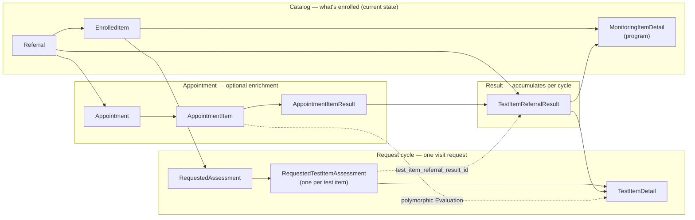
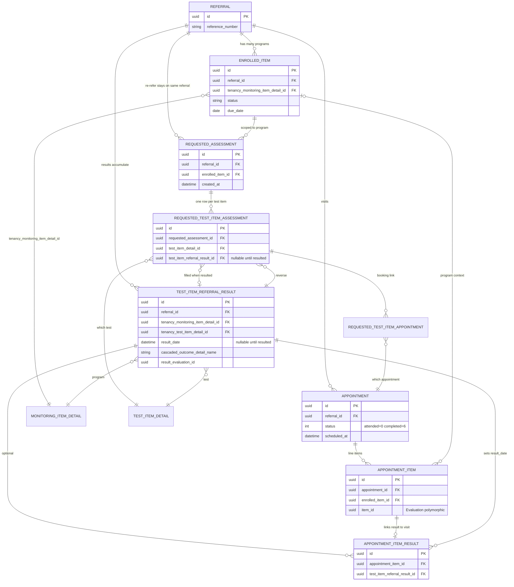
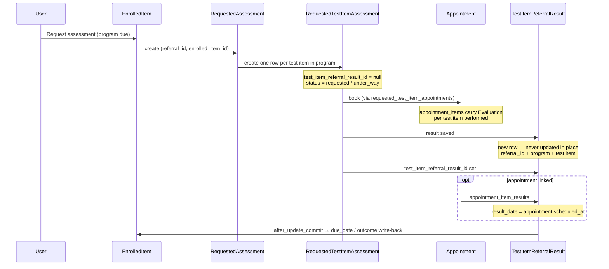
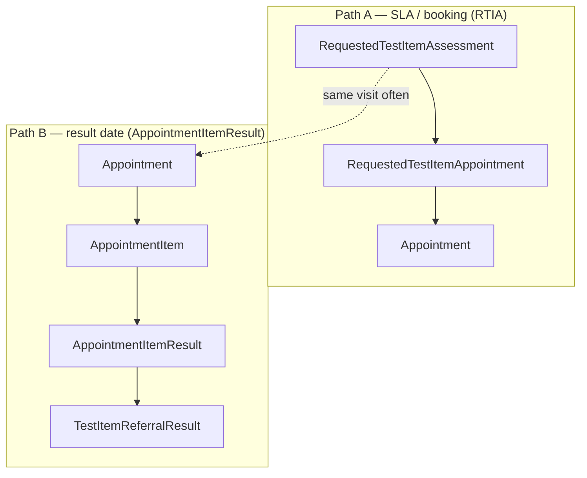
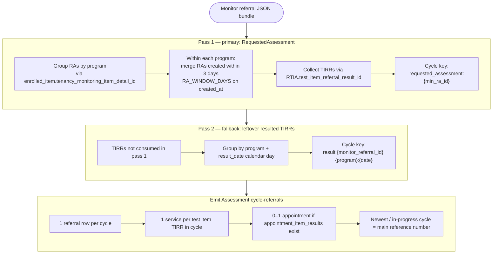
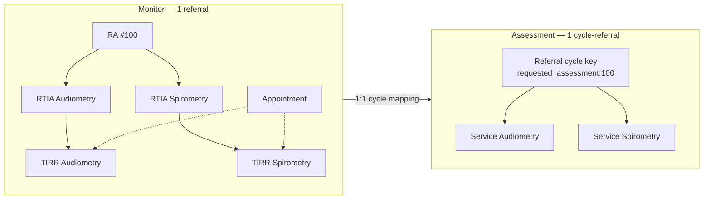
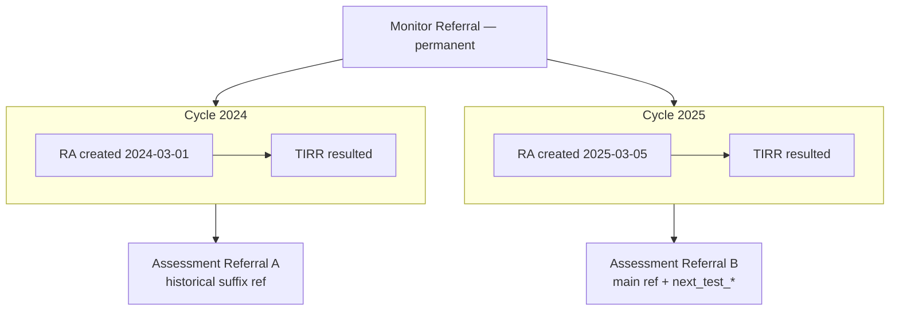
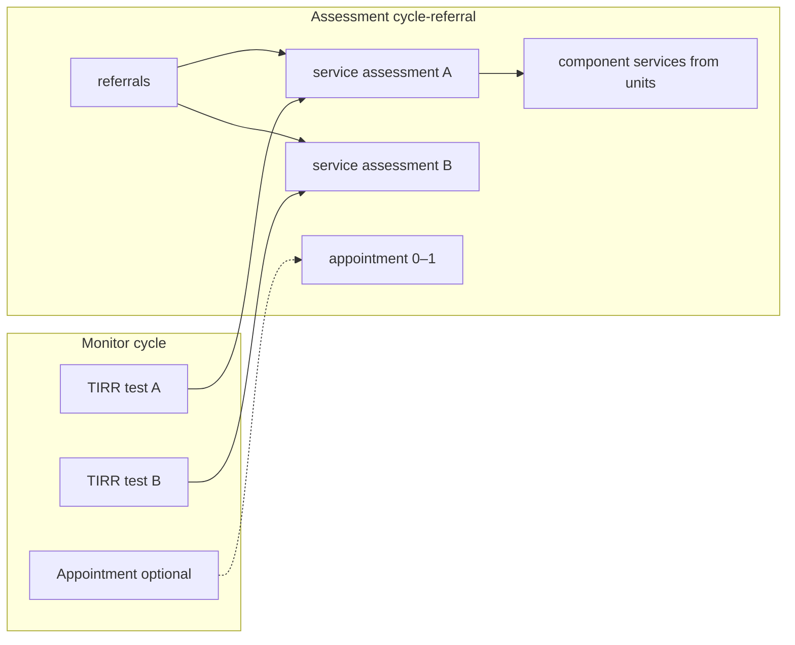

# Monitor: Cycle Referral Grouping — Data Model

How **Appointment**, **TestItem**, **RequestedAssessment (RA)**, and
**TestItemReferralResult (TIRR)** connect in Monitor — and how that graph is
split into **N Assessment cycle-referrals** during migration.

> **Scope:** execution + request-cycle entities only. For catalog hierarchy
> (MonitoringItem → TestItem → TestItemUnit) see
> [data-model.md](data-model.md). For referral lifecycle and re-refer behaviour
> see [referral-enrolled-item.md](referral-enrolled-item.md). For field-level
> migration rules see
> [`referral-grouping.md`](../../carelever_assessment/script/migrate-monitor/specs/referral-grouping.md)
> in `carelever_assessment`.

---

## The shape mismatch (why grouping exists)

| | **Monitor** | **Assessment (target)** |
|---|---|---|
| Referral | **One permanent row** per worker | **One row per assessment cycle** |
| Re-test | New `RequestedAssessment` on the **same** referral | **New referral** |
| Result history | TIRR rows **accumulate** on one referral | No per-cycle history table — each cycle is its own referral |
| Program | `EnrolledItem` (ongoing enrolment) | Program = the referral's services |

**Migration rule:** one Monitor referral → **N Assessment cycle-referrals**, where
**N = number of (program × cycle) pairs** found in execution data — not the count
of enrolled items or TIRR rows.

**Granularity:** one Assessment referral per **program per cycle** — not per worker,
not per enrolment, not per TIRR row.

---

## Three layers on one Monitor referral

Monitor stores three related views of the same worker file. Cycle grouping reads
mainly from the **request + result** layers; appointments are optional enrichment.



| Layer | Anchor entity | Answers |
|---|---|---|
| Catalog | `EnrolledItem` | Which programs is this worker enrolled in? What is due next? |
| Request cycle | `RequestedAssessment` → `RequestedTestItemAssessment` | Which tests were requested for **this visit**? SLA / booking tracking. |
| Result | `TestItemReferralResult` | What was the outcome for **this test on this cycle**? |
| Appointment | `Appointment` → `AppointmentItem` → `AppointmentItemResult` | Where/when was the test performed? Sets `TIRR.result_date` when linked. |

**Do not drive migration off `enrolled_items.status`.** Status is current enrolment
state; completed/stopped programs still have past cycles in TIRR history.

---

## Entity relationship diagram

Core FK graph for cycle grouping (modern path — TIRR + RA, not legacy `Result`).



### Association sources (Monitor codebase)

| From | To | How |
|---|---|---|
| `RequestedAssessment` | `RequestedTestItemAssessment` | `has_many` (`requested_assessment.rb:17`) |
| `RequestedTestItemAssessment` | `TestItemReferralResult` | `belongs_to :test_item_referral_result, optional: true` (`requested_test_item_assessment.rb:44`) |
| `RequestedTestItemAssessment` | `Appointment` | `has_many :appointments, through: :requested_test_item_appointments` |
| `TestItemReferralResult` | `AppointmentItemResult` | `has_many :appointment_item_results` (`test_item_referral_result.rb:43`) |
| `AppointmentItemResult` | `TestItemReferralResult` | `belongs_to`; `after_create_commit` sets `result_date` from appointment `scheduled_at` (`appointment_item_result.rb:41-45`) |
| `AppointmentItem` | `Evaluation` → test | polymorphic `item_id` / `item_type='Evaluation'` (`appointment_item.rb:40-41`) |

Legacy path `Evaluation → Result` (pre-TIRR) is **not** the cycle-grouping driver.
See [referral-test-item-linkage.md](referral-test-item-linkage.md) §"Results (migration target)".

---

## Request cycle chain (RA → RTIA → TIRR)

Each **re-refer** or **request assessment** action creates a new request cycle on
the **same** Monitor referral:



**One cycle's tests** are enumerated by walking:

```
RequestedAssessment
  → requested_test_item_assessments[]
      → test_item_referral_result_id  →  TestItemReferralResult (0..1 while in flight)
      → test_item_detail_id           →  which test item
```

A single visit with **multiple test items** produces **one RA**, **multiple RTIAs**,
**multiple TIRRs** — but migration emits **one Assessment referral** for that cycle
(with **one service per test item**).

---

## Appointment ↔ TIRR linkage (two paths)

Appointments connect to results in two ways. Cycle grouping treats the appointment
as **enrichment**, not a scope gate — a resulted TIRR without any appointment is
valid ("result-only" cycle).



| Path | Table | Purpose in grouping |
|---|---|---|
| A | `requested_test_item_appointments` | Which appointment fulfilled this RTIA's booking SLA |
| B | `appointment_item_results` | Links performed appointment line item to TIRR; **writes `result_date`** |

**Result-only TIRRs** (manual entry, Screen import, unlinked appointment): no path B
row → group in **fallback** pass by `(program, result_date day)` instead of RA.

---

## Cycle boundary rules

### What defines a "cycle"

| Concept | Monitor anchor | Notes |
|---|---|---|
| **Program** | `tenancy_monitoring_item_detail_id` | Same monitoring item across years |
| **Cycle** | One `RequestedAssessment` cluster, else one `result_date` day bucket | One visit / one request wave |
| **Test item** | `tenancy_test_item_detail_id` on TIRR / `test_item_detail_id` on RTIA | Multiple per cycle → multiple services, one referral |

### Grouping algorithm (migration)



**3-day RA merge:** a single physical visit can spawn **multiple RAs** (one per
test item, minutes or days apart). RAs of the **same program** within **3 days**
collapse to **one cycle** — avoiding one Assessment referral per RA for the same
visit.

**>3 days apart, same program** → separate cycles → separate Assessment referrals
(year-over-year re-test pattern).

### Resulted vs in-progress

| State | Detection | Migration treatment |
|---|---|---|
| **Resulted** | `result_evaluation_id IS NOT NULL` OR `cascaded_outcome_detail_name IS NOT NULL` | `processing_mode: completed`, billing safeguard `billed` |
| **In-progress** | RA exists, TIRR not resulted (`result_date` NULL, no outcome) | Active referral — `processing_mode` ≠ completed, `billing_status: unbilled` |
| **Not history** | `result_date` NULL and no outcome | Requested-but-unresulted; not a completed historical cycle |

---

## Worked examples

### Example 1 — One visit, two tests (one cycle)

Same program, one RA, two RTIAs, two TIRRs, one appointment:



### Example 2 — Same program, two years (>3 days apart)

Two request cycles on the same Monitor referral → two Assessment referrals:



### Example 3 — Two RAs within 3 days merge

Two RAs for the same program (Audiometry RA Monday, Spirometry RA Wednesday — same
visit window) → **one** cycle, **two** services:

```
RA #201 (Mon) ─┐
               ├─► cycle key requested_assessment:201  →  1 Assessment referral
RA #202 (Wed) ─┘       services: [Audiometry TIRR, Spirometry TIRR]
```

### Example 4 — Result-only (no RA, no appointment)

Manual / Screen result with no `RequestedAssessment`:

```
TIRR (program X, result_date 2023-06-15, outcome set)
  → fallback cycle key result:{referral_id}:X:2023-06-15
  → 1 Assessment referral, no appointment attached
```

---

## Monitor → Assessment record map (per cycle)



| Monitor | Assessment | Cardinality per cycle |
|---|---|---|
| Cycle (RA cluster or result bucket) | `referrals` row | 1 |
| `TestItemReferralResult` | `services` (assessment) | 1 per test item |
| Test item units | `services` (components) + `component_variant_id` | per unit |
| `Appointment` (if linked) | `appointments` + `appointment_services` | 0–1 per cycle |
| TIRR outcome | `service.doctor_outcome` | per service |
| `monitor_cycle_key` | upsert id | `requested_assessment:{id}` or `result:{…}` |

Catalog mapping (`test item → assessment / variation`, `unit → component`) is
prerequisite — see
[`../carelever_assessment/script/migrate-monitor/mapping/`](../../carelever_assessment/script/migrate-monitor/mapping/).

---

## Quick reference — which entity answers which question

| Question | Look at |
|---|---|
| Which **program** is this? | `enrolled_items.tenancy_monitoring_item_detail_id` or `TIRR.tenancy_monitoring_item_detail_id` |
| Which **test** is this? | `RTIA.test_item_detail_id` / `TIRR.tenancy_test_item_detail_id` |
| Which **visit request** started this cycle? | `RequestedAssessment` (+ `created_at` for 3-day clustering) |
| Which **tests were in that request**? | `RequestedTestItemAssessment` rows under the RA |
| Which **result row** is this cycle's outcome? | `TIRR` linked from RTIA, or fallback bucket by `result_date` |
| When was the test **performed**? | `TIRR.result_date` (from appointment link or manual date) |
| Where was it **performed**? | `appointment_item_results` → `appointment_items` → `appointments` |
| Is this cycle **done**? | TIRR `is_completed?` — outcome/evaluation present, not merely `result_date` |
| What's **due next** for the program? | Latest resulted TIRR → `next_tests` → `enrolled_item.due_date` (migrate end state to Assessment `referrals.next_test_*` on main cycle only) |

---

## Related docs

| Doc | Contents |
|---|---|
| [referral-enrolled-item.md](referral-enrolled-item.md) | Permanent referral, re-refer = new RA, next-test write-back |
| [referral-test-item-linkage.md](referral-test-item-linkage.md) | Full catalog + execution chains, TIRR columns, migration scoping SQL |
| [data-model.md](data-model.md) | Item hierarchy, tenancy override, core ERD |
| [`referral-grouping.md`](../../carelever_assessment/script/migrate-monitor/specs/referral-grouping.md) | Authoritative migration grouping spec (in-progress, archived, billing) |
| [`TESTING-REFERRALS.md`](../../carelever_assessment/script/migrate-monitor/TESTING-REFERRALS.md) | Test cases 1–3 for cycle fan-out |
