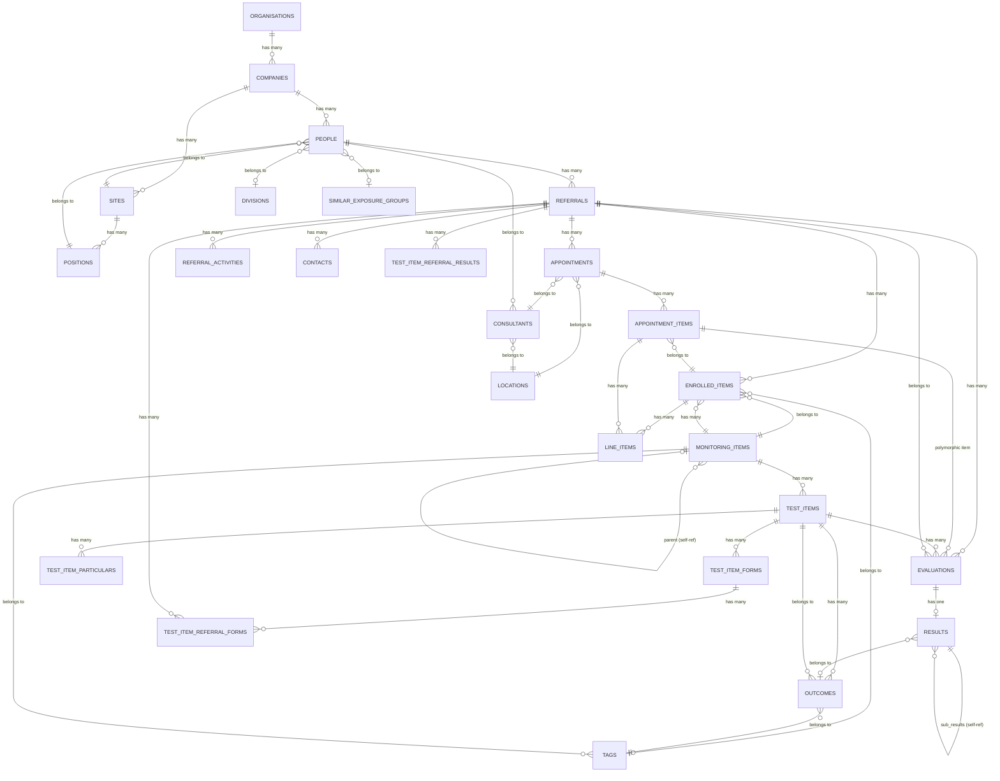

# Monitoring Service Data Model

## Item Hierarchy

```
MonitoringItem (what to monitor)
  ├── TestItem (specific test within monitoring)
  │     └── TestItemUnit (sub-component of a test)
  │
  └── EnrolledItem (worker enrolled in this monitoring)
```

### MonitoringItem

Top-level monitoring program assigned to a company/site/position. E.g. "Health Surveillance - Coal Mining".

Key fields: `name`, `description`, `company_id`, `site_id`, `position_id`, `service_item_id`, `default_tag_id`, `default_outcome_id`, `is_default`

### TestItem

A specific test within a monitoring item. E.g. "Audiometry", "Spirometry", "Drug & Alcohol".

- `belongs_to :monitoring_item`
- Key fields: `name`, `duration_in_minutes`, `internal_price`, `external_price`, `external_cutoff_cost`, `item_code`, `slug`, `category`, `outcome_processor`, `default_outcome_id`, `has_summary_report`
- Scoped to company/site/position via `company_id`, `site_id`, `position_id`
- `base_id` links overrides back to the base test item

### TestItemUnit (via `test_item_unit_details`)

A sub-component of a test item. E.g. within "Drug & Alcohol", units might be "Urine Collection", "Breath Alcohol".

Key fields: `name`, `duration_in_minutes`

### EnrolledItem

A worker enrolled in a monitoring program — links a referral to a monitoring item.

Key fields: `monitoring_item_id`, `referral_id`, `status`, `due_date`, `result_due_date`, `tag_id`, `suggested_test_item_id`, `cascaded_monitoring_item_name`, `cascaded_outcome_detail_name`, `cascaded_frequency_type`, `cascaded_frequency_value`, `cascaded_has_health_risk`

## Tenancy Override Pattern (Detail / Set)

The monitoring service uses a two-tier pattern for configurable items:

| Level | Tables | Purpose |
|---|---|---|
| Global/tenant definition | `monitoring_item_details`, `test_item_details`, `test_item_unit_details` | Base definitions at the tenant level |
| Company/site/position override | `monitoring_item_sets`, `test_item_sets`, `test_item_set_units` | Overrides scoped to company + site + SEG + position |

This allows a base definition at the tenant level, with company/site/position-specific overrides (e.g. different tests for different positions).

The `tenancy_*_id` fields link an override set back to its base detail definition.

### ⚠️ The settings-UI "monitoring item" ≠ the `monitoring_items` table

The internal-UI **settings/options** screens list "monitoring items", but they do
**not** read the `monitoring_items` table. They read the **`MonitoringItemDetail`
cluster**, resolved through the `Cascadable` concern's **CSSP** cascade
(company / site / SEG / position, 8 priority levels, tenancy = all-nil base rows):

- `V3::MonitoringItems::Index` → `MonitoringItemPreference.cascade_with_details(cssp)`
  — joins `MonitoringItemDetail` (`cascading_sql`) + `monitoring_item_commons`,
  selecting name / description / `is_default` / `required_referral_roles`.
- `Options::MonitoringItemDetails::Index` → `MonitoringItemDetail.cascade(cssp, true)`.

The cluster, keyed by `tenancy_monitoring_item_detail_id` (the cascade `base_id`):

| Table | Role |
|---|---|
| `monitoring_item_details` | tenancy + CSSP-override rows (name, description) |
| `monitoring_item_preferences` | `is_default` / `is_hidden` per CSSP |
| `monitoring_item_commons` | one per tenancy id — `required_referral_roles`, `result_list_additional_columns` |
| `monitoring_item_sets` (+ `…_set_test_item_details`) | which test item details belong to the item per CSSP |
| `monitoring_item_detail_test_item_detail_outcome_details` | outcome config per detail row |

The `monitoring_items` table is a **separate** per-referral/CSP enrolment-cascade
concept (`cascaded_monitoring_items` SQL fn, `MonitoringItem.where_csp`) — that's
why `MonitoringItem.all` can be empty in a tenant that has fully-configured
settings. The Monitor→Assessment export
(`script/migtate-monitor/monitoring_items_export.rb` in `carelever_assessment`)
targets the `MonitoringItemDetail` cluster, grouped by `tenancy_monitoring_item_detail_id`.

### Join Tables

| Table | Joins |
|---|---|
| `monitoring_item_set_test_item_details` | Links monitoring item sets to test item details |
| `monitoring_item_detail_test_item_detail_outcome_details` | Links monitoring item details to test item detail outcomes |
| `test_item_set_units` | Links test item sets to test item unit details |

## Related Tables

### Pricing & Configuration

- `test_item_pricing_details` — pricing overrides per company/site/position
- `test_item_frequency_details` — how often a test should recur
- `test_item_particulars` — additional test-specific configuration
- `item_durations` — duration overrides
- `item_reminders` — reminder scheduling for upcoming tests

### Results & Outcomes

- `test_item_outcome_sets` — outcome option groups for a test
- `test_item_outcome_set_outcome_details` — individual outcome options within a set
- `test_item_referral_results` — actual test results for a referral
- `test_item_referral_result_criteria` — criteria evaluated against results
- `test_item_result_config_details` — result display/processing configuration
- `test_item_result_fields` — individual fields within a result
- `test_item_criteria_sets` / `test_item_criteria_set_units` — evaluation criteria

### Forms

- `test_item_forms` — forms attached to test items
- `test_item_form_templates` — form templates for test items
- `test_item_form_marking_matrices` — marking/scoring matrices for forms
- `test_item_referral_forms` — completed forms per referral
- `test_item_referral_form_groups` / `test_item_referral_form_group_results` — grouped form results

### Appointments

- `appointment_items` — appointment line items
- `appointment_item_referral_forms` — forms linked to appointment items
- `appointment_item_results` — results linked to appointment items
- `appointment_item_particulars` — additional appointment item config
- `requested_test_item_appointments` — appointment requests for test items
- `requested_test_item_assessments` — assessment requests for test items

### Enrolled Item Management

- `enrolled_item_reminders` — reminders for enrolled workers
- `enrolled_item_status_change_triggers` — automation triggers on status change
- `enrolled_item_upcoming_next_tests` — upcoming scheduled tests

## Synced to Screen

Screen receives simplified versions via data sync:

| From Monitoring | In Screen |
|---|---|
| `MonitoringItemDetail` | `monitoring_item_details` — name, description, company/site/position scope |
| `TestItemDetail` | `test_item_details` — name, description, duration, form/result flags |

These are read-only in screen — used to display monitoring context on referrals.

## ERD (Core Tables)



### Key Domain Concepts

| Entity | Role |
|---|---|
| `referrals` | Central record — links a person to their monitoring program |
| `enrolled_items` | A specific monitoring item assigned to a referral (e.g. "Annual Hearing Test") |
| `monitoring_items` | Catalog of monitoring programs (hierarchical, self-referential) |
| `test_items` | Individual assessments under a monitoring item |
| `evaluations` | One test_item performed in one appointment |
| `results` | Outcome of an evaluation — links to next test date, outcome, sub-results |
| `outcomes` → `tags` | Determine next monitoring frequency/tag after a result |

Multi-tenancy flows through **Company → Site → Position** (CSP) — most tables carry `company_id`, `site_id`, `position_id` for cascading defaults.

## Mapping to Assessment/Replit

| Monitoring | Assessment | Notes |
|---|---|---|
| `MonitoringItem` | `ServiceItem` (`is_health_monitoring: true`) | Flat vs hierarchical |
| `TestItem` | `ServiceVariation` or child `ServiceItem` | Assessment doesn't distinguish test vs monitoring item |
| `TestItemUnit` | `ComponentVariant` | Sub-components of a service |
| `EnrolledItem` | No equivalent | Assessment doesn't track ongoing enrolment |
| Detail/Set override pattern | `AssessmentMatrixConfig` | Company/site/position scoping |
| `TestItemFrequencyDetails` | `next_test_rules` | Recurrence scheduling |
| `TestItemOutcomeSets` | `service_outcome_options` | Outcome definitions |
