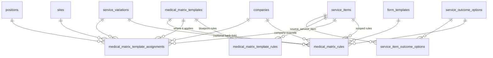

# Medical Matrix Data Model

The Medical Matrix is the rules engine that maps **form responses (or cross-assessment
outcomes) → medical outcomes, comments, restrictions, and candidate notifications**.

There are **two layers**:

- **Template layer (newer, CT-4606):** reusable rule blueprints authored on a
  `medical_matrix_template`, then attached to services via assignments.
- **Scoped-rule layer (original):** rules attached directly to a service item, with
  company/site/variation overrides — this is what gets evaluated at runtime.

The two share nearly identical rule columns (`conditions`, `outcome`, `match_operator`,
`custom_comments`, `notify_candidate`, …); they differ in **scoping and role**.

---

## ERD



---

## Template layer

### `medical_matrix_templates`
Reusable, named matrix blueprint.

- Fields: `name` (unique), `description`, `template_type` (default `medical`), `active`.
- `has_many :medical_matrix_template_rules` (blueprint rules)
- `has_many :medical_matrix_template_assignments` (where/to-whom it applies)
- `has_many :medical_matrix_rules` (optional back-link from scoped rules)

### `medical_matrix_template_rules`
The rule definitions that live on a template — **scoping-free**.

- FKs: `medical_matrix_template_id` (required, `ON DELETE cascade`), `source_service_item_id` (optional, for cross-assessment rules).
- Rule payload: `conditions` (jsonb), `outcome`, `match_operator`, `condition_logic`
  (`single`/`and`/`or`), `rule_type` (`form_response`/`cross_assessment_outcome`),
  `question_key`, `answer_trigger`, comment fields, `notify_candidate` +
  `candidate_notification_text`, `candidate_document_*`, `custom_comments` (jsonb),
  `source_outcome`, `source_service_variation_ids` (jsonb), `position`.
- Managed under `app/commands/v1/settings/medical_matrix_templates/rules/` (the
  "Outcome Matrix Template Rules" tab). `CopyFrom` appends every rule from a source
  template (best-effort, no dedupe).

### `medical_matrix_template_assignments`
Binds a template to a service context — carries the scoping the template rules lack.

- FKs: `medical_matrix_template_id` (required, `ON DELETE restrict`), `service_item_id`
  (required), optional `service_variation_id`, `company_id`, `site_id`, `position_id`.
- `safety_critical` flag is part of every uniqueness key.
- Uniqueness: base assignment, variation assignment, and company override are each
  unique on their respective scope columns + `safety_critical`.

---

## Scoped-rule layer

### `medical_matrix_rules`
Rules attached directly to a service item, with company/variation overrides — **this is
what gets resolved and evaluated at runtime**.

- FKs: `service_item_id` (required), `service_variation_id`, `company_id`,
  `form_template_id`, `service_outcome_option_id`, `source_service_item_id`, and
  optional `medical_matrix_template_id`.
- Same rule payload columns as `medical_matrix_template_rules`, plus `condition_name`.
- Resolution scopes: `default_rules` (`company_id IS NULL`), `for_company`,
  `for_variation`, `base_variation_rules` (`service_variation_id IS NULL`),
  `for_service_item`, `for_question`, `for_template`, `form_response_rules`,
  `cross_assessment_rules`, `active`, `ordered`.

---

## Outcome options (referenced by rules)

| Table | Role |
|---|---|
| `service_outcome_options` | Catalog of possible outcomes (`name`, `color`, `display_order`, `active`). |
| `service_item_outcome_options` | Join: which outcome options apply to which service item (M:N). |

A `medical_matrix_rule` may point at a specific `service_outcome_option_id`; its
free-text `outcome` column is the canonical outcome string the rule asserts.

---

## How the layers relate

```
MedicalMatrixTemplate (blueprint)
  ├── medical_matrix_template_rules        scoping-free rule definitions
  └── medical_matrix_template_assignments  → service_item (+ variation/company/site/position, safety_critical)

ServiceItem (runtime target)
  └── medical_matrix_rules                 scoped rules resolved & evaluated against form responses
        ↘ (optional) medical_matrix_template_id back-link
```

- **Template layer** = author-once, assign-many (reuse across services/companies).
- **Scoped layer** = the concrete rules evaluated for a given service item / variation /
  company when producing a referral's medical outcome.

---

## Quick reference — where to look

- **Models:** `medical_matrix_template.rb`, `medical_matrix_template_rule.rb`,
  `medical_matrix_template_assignment.rb`, `medical_matrix_rule.rb`,
  `service_outcome_option.rb`, `service_item_outcome_option.rb`
- **Template commands:** `app/commands/v1/settings/medical_matrix_templates/`
  (incl. `rules/`, `assignments/`)
- **Internal commands:** `app/commands/v1/internal/medical_matrix_templates/`,
  `app/commands/v1/internal/assessment_matrix_configs/`
